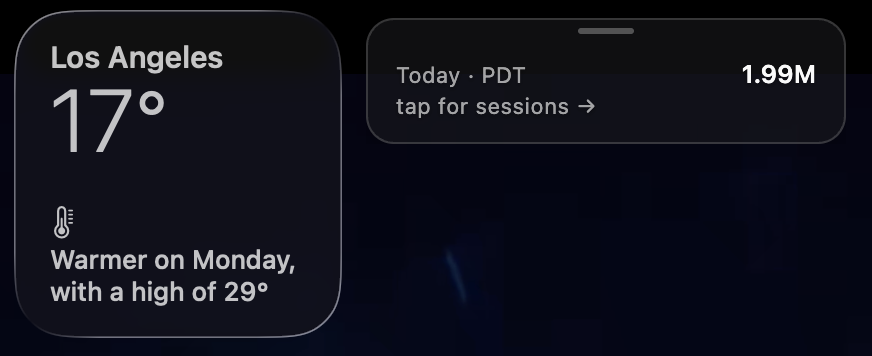
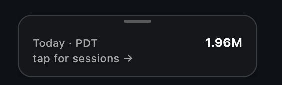

<div align="center">

🌐 [English](README.md) | [中文](README.zh.md) | **Español** | [한국어](README.ko.md) | [Português](README.pt-BR.md)

# Idle — Monitor de Tokens para Claude Code

**Un monitor en tiempo real del uso de tokens y de las sesiones de [Claude Code](https://claude.com/claude-code), para macOS.**
Una pequeña cápsula translúcida flota en la esquina de tu pantalla y muestra, en vivo, cuántos tokens han consumido todas tus sesiones de Claude Code hoy.



[](https://github.com/xixvtt/Idle/commits/main)
[](LICENSE)

</div>

---

## ¿Qué es Idle?

Idle es un **monitor de uso de tokens para Claude Code**, gratuito y de código abierto. Se ejecuta como una superposición translúcida sobre macOS y rastrea:

- **El total de tokens de Claude Code consumidos hoy** — en vivo, sumando todas las sesiones y proyectos
- **Lista de sesiones activas** — qué workspaces están en ejecución, esperando o inactivos en este momento
- **Monitoreo multi-sesión** — una fila por cada sesión de Claude Code abierta
- **Alertas al terminar** — te avisa en el instante en que una tarea de Claude Code finaliza

Si trabajas en modo YOLO y agotas tu cuota diaria sin darte cuenta, Idle es la cura. Sin pestañas de navegador, sin dashboards, sin API key — solo un monitor visible en tu escritorio.

<div align="center">
  
</div>

## Por qué usar Idle con Claude Code

| Problema | Solución de Idle |
|---|---|
| Anthropic no muestra un total diario de uso de tokens | Idle lee los transcripts locales de Claude Code y calcula el total de hoy en vivo |
| Ejecutar varias sesiones de `claude` vuelve imposible llevar la cuenta | Idle apila cada sesión activa en una sola ventana |
| Solo te enteras al llegar al límite, cuando Claude deja de responder | Idle muestra tu conteo de tokens en todo momento |
| Otros monitores requieren API key o envían datos a la nube | Idle es 100% local — sin red, sin API key |

## Instalación (sin configuración)

Descarga la última versión: **[Página de Releases →](https://github.com/xixvtt/Idle/releases)**

| Mac | Archivo |
|---|---|
| Apple Silicon (M1/M2/M3/M4) | `Idle-x.x.x-arm64.zip` |
| Intel | `Idle-x.x.x-x64.zip` |

1. Haz doble clic en el zip para extraer `Idle.app`
2. **Clic derecho sobre `Idle.app` → Abrir → Abrir** (la app no está firmada — Gatekeeper pregunta una sola vez)
3. Elige tu tema en el primer arranque
4. Usa Claude Code normalmente — el seguimiento empieza al instante

Sin Python, sin terminal, sin editar JSON. El daemon incluido y los hooks de Claude Code se instalan solos.

### "Apple no pudo verificar que Idle esté libre de malware"

Es Gatekeeper bloqueando una app sin firmar. Ejecuta esto en Terminal para limpiar el atributo de cuarentena:

```bash
xattr -cr /Applications/Idle.app
# o, si la descomprimiste en otro lugar:
xattr -cr ~/Downloads/Idle.app
```

Luego haz doble clic en `Idle.app` con normalidad.

Si macOS sigue rechazándola, abre **Ajustes del sistema → Privacidad y seguridad**, baja hasta el final — verás "Idle ha sido bloqueada…" con un botón **Abrir igualmente**. Púlsalo una vez.

> Idle estará firmada y notarizada por Apple en un futuro release. La versión actual no está firmada porque la membresía de Apple Developer cuesta $99/año — lo cubriremos en cuanto Idle tenga suficientes usuarios y estos pasos desaparecerán.

## Requisitos

- macOS 12 o superior
- [Claude Code](https://claude.com/claude-code) instalado

## Cómo monitorea Idle a Claude Code (detalle técnico)

Idle utiliza únicamente dos fuentes de datos locales:

1. **Hooks de Claude Code** — Claude Code dispara hooks de shell en cada uso de herramienta, solicitud de permiso y finalización de tarea. El daemon de Idle los recibe en `127.0.0.1:7777` para rastrear el estado en tiempo real.
2. **Archivos JSONL de transcript** — Claude Code escribe un transcript completo en `~/.claude/projects/`. Idle solo lee el campo `usage` (input + output + cache_creation tokens) de cada mensaje del asistente, filtrado por la fecha local de hoy.

El total de tokens se recalcula desde estos archivos al iniciar y cada 30 segundos, así que siempre es exacto — incluso tras un reinicio.

## Privacidad

- **Sin tráfico de red saliente.** El daemon escucha solo en `127.0.0.1`.
- **Sin API key.** Idle no llama a la API de Anthropic.
- **Nunca lee prompts ni respuestas.** Solo lee campos numéricos de uso. Garantizado por un test de AST.
- **Código abierto (MIT).** Audítalo tú mismo.

## Dale una ⭐ a este repo

Si Idle te ahorra tiempo o dinero en Claude Code, dale una estrella al repo — es la señal más importante para que más desarrolladores descubran el proyecto. Issues, PRs y feedback son bienvenidos.

---

**Palabras clave:** Claude Code, monitor de tokens de Claude Code, rastreador de uso de Claude Code, uso de tokens de Anthropic, dashboard de Claude Code, monitorear Claude Code, gestor de sesiones de Claude Code, rastreador de límite de Claude Code, Claude Code macOS, overlay para Claude Code.
